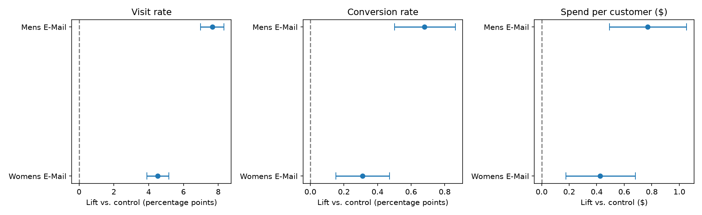
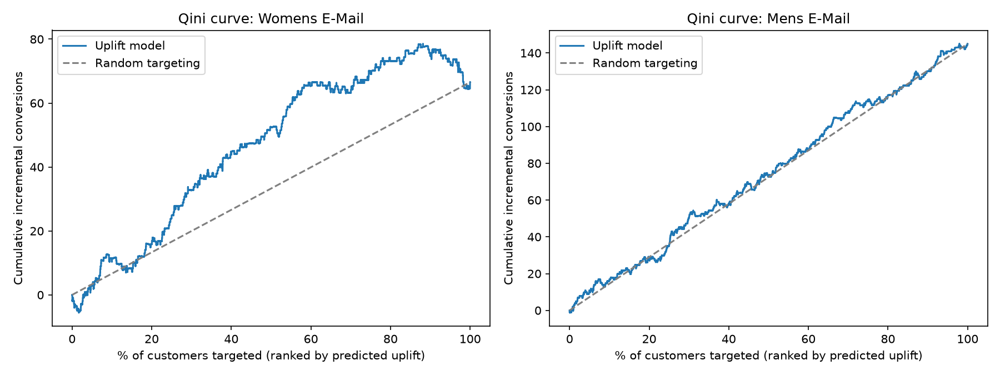
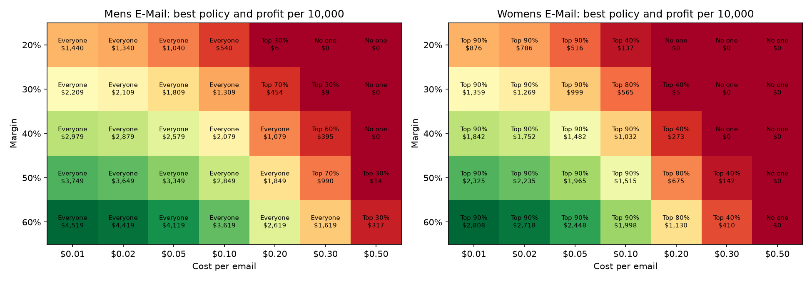

# Who Should We Email? Incrementality and Targeting on a Randomized Email Experiment

Python (pandas, scikit-learn, scipy) · PostgreSQL · Streamlit

Data: Hillstrom "MineThatData" E-Mail Analytics Challenge (2008). 64,000 customers, randomly assigned to a men's email, a women's email, or no email. Two weeks of visit, purchase and spend outcomes.

Deliverables: [executive memo](docs/exec_memo.md) · [dashboard](dashboard/app.py) · [auto-generated readout with number checks](src/09_generate_readout.py) · [writeups](docs/)

---

## Summary

A retailer emailed some customers and not others, at random. I used the results to answer two questions: did the emails cause extra purchases, and who should get them next time to maximize profit?

Main results:

- Both emails increased purchases. The men's email took the two-week purchase rate from 0.57% to 1.25%. The women's email took it to 0.88%.
- A standard attribution report would overstate the effect by about 2x. Of the 267 purchases it would credit to the men's email, roughly 122 would have happened without it.
- The men's email works about equally well for every type of customer. The women's email works for new customers and prior women's-merchandise buyers, does little for other groups, and may slightly reduce purchases among mid-spend customers.
- An uplift model can rank customers by predicted response for the women's email (top 30% capture 49% of incremental sales). For the men's email there is no useful variation to model.
- Recommendation: send the men's email to everyone. At $0.05 per email and a 40% margin that is worth about $2,600 in incremental profit per 10,000 customers over two weeks, and it stays profitable until email cost exceeds about $0.30. If the women's email is used, exclude the lowest 10% of customers by predicted response.

---

## Skills used

| Area | What I did |
|---|---|
| Experiment analysis | Checked randomization balance, estimated lift with bootstrap confidence intervals, corrected for two treatments against one control, ran a power analysis |
| Causal inference | Separated incremental purchases from purchases that would have happened anyway; compared to naive attribution |
| Machine learning | Built a T-learner uplift model, evaluated it out-of-sample with decile tables and Qini curves |
| Business analysis | Converted lift to profit under stated cost and margin assumptions, compared sending policies, ran sensitivity analysis |
| Communication | One-page memo, dashboard with metric definitions and live assumption sliders, plain-English readout |
| Data quality | Readout script extracts every number from its own text and checks it against the result tables |
| Engineering | Postgres schema and load, nine numbered Python scripts, fixed random seeds for full reproducibility |

---

## Results

### Did the emails work?

| | No email | Men's email | Women's email |
|---|---|---|---|
| Customers | 21,306 | 21,307 | 21,387 |
| Visited the site | 10.6% | 18.3% | 15.1% |
| Purchased | 0.57% | 1.25% | 0.88% |
| Spend per customer | $0.65 | $1.42 | $1.08 |
| Incremental spend per customer | — | +$0.77 (95% CI 0.49 to 1.05) | +$0.42 (95% CI 0.18 to 0.68) |

All six effects (visit, purchase, spend for each email) are significant after a Holm correction for multiple comparisons. Spend is heavily skewed (99% of customers spent nothing), so the confidence intervals come from a 5,000-sample bootstrap rather than a normal approximation.

### Attribution vs. incrementality

Attribution counts purchases among emailed customers and credits them all to the email. The control group shows how many of those would have happened anyway.

| | Women's email | Men's email |
|---|---|---|
| Purchases among emailed customers | 189 | 267 |
| Expected without the email (control rate × emailed customers) | 122 | 122 |
| Purchases caused by the email | 67 | 145 |
| Share of attributed purchases that were incremental | 35% | 54% |

### Who responds

I split the results by traits fixed before the email was sent: new vs. existing, channel, past spend, region, recency, and prior men's/women's purchases.

Men's email: positive lift in almost every segment, with confidence intervals clear of zero. Largest for heavy past spenders and multichannel shoppers. No group shows a negative effect.

Women's email:
- New customers +0.53 pts; existing customers +0.09 pts (interval includes zero)
- Prior women's-merchandise buyers +0.51 pts; others +0.06 pts (interval includes zero)
- Phone-channel shoppers +0.17 pts (interval includes zero)
- $200–$500 past spend: negative point estimate on both purchases and spend. The interval includes zero, so this is a hypothesis rather than a finding.

In uplift terms:

| Type | Definition | Observed in |
|---|---|---|
| Persuadables | Buy only because of the email | New customers, heavy past spenders, multichannel shoppers |
| Sure things | Would buy anyway | Existing customers with women's purchase history (women's email) |
| Lost causes | Don't buy either way | Phone-channel shoppers (women's email) |
| Sleeping dogs | Less likely to buy if emailed | Mid-spend customers (women's email), needs a follow-up test |

### Uplift model

Two gradient-boosting classifiers, one trained on emailed customers and one on the control group. The difference in predicted purchase probability is each customer's uplift score. Scores are out-of-sample via 5-fold cross-fitting, repeated over three random splits and averaged.

Women's email:
- Qini coefficient 11.6 / 11.4 / 12.2 across the three splits
- Top decile by predicted uplift: actual lift +0.48 pts. Bottom decile: −0.39 pts
- Top 30% of customers account for 49% of incremental conversions
- The Qini curve peaks around 85% of customers and then declines, so the lowest-scored 15% reduce total incremental sales

Men's email:
- Qini coefficient 2.6 / 3.2 / 1.3, close to random and unstable
- Deciles are unordered; the lowest-scored decile has actual lift +0.70 pts, higher than several deciles ranked above it
- Consistent with the segment analysis: the effect is roughly uniform, so there is little heterogeneity to predict

The same pipeline produced a stable ranking for one email and none for the other, which is what you'd expect if the model is working and the men's effect really is uniform.

### Profit by policy

Assumptions: $0.05 per email, 40% margin on revenue. Both are adjustable in the script and the dashboard.

| Policy | Incremental profit per 10,000 customers (2 weeks) |
|---|---|
| Men's email to everyone | $2,579 (95% CI 1,469 to 3,714) |
| Women's email to top 90% by uplift score | $1,482 |
| Women's email to everyone | $1,198 |
| No email | $0 |

Targeting does not improve the men's email because no segment is harmed by it. For the women's email, dropping the bottom 10% raises profit by about 24%.

Break-even cost per email: about $0.31 for the men's email, $0.17 for the women's. Targeting the men's email only starts to pay off above roughly $0.20 per email. Each 10-point increase in margin adds about $770 per 10,000 customers to the men's email's profit.

---

## Charts

Lift vs. control with 95% confidence intervals:



Qini curves. Blue is incremental conversions captured when emailing customers in the model's ranked order; grey is random order. The women's model beats random and declines at the tail; the men's model tracks random.



Best policy and profit per 10,000 customers across email cost and margin:



---

## Method

| Step | Method | Output |
|---|---|---|
| Randomization check | Balance table on pre-treatment variables; one-way ANOVA for numeric, chi-square for categorical. All p > 0.35 | `randomization_tests.csv` |
| Lift estimation | Difference in means; 5,000-sample bootstrap CIs; two-proportion z-test for rates, Welch t-test for spend; Holm correction across the two treatment arms | `lift_results.csv` |
| Power | Analytic MDE at 80% power, alpha 0.025. MDE for conversion ≈ 0.23 pts | `power_mde.csv` |
| Incrementality | Treated conversions minus control rate × treated n, vs. naive attribution | `incrementality_vs_attribution.csv` |
| Segment analysis | Lift with CIs within each level of seven pre-treatment variables | `segment_lift.csv` |
| Uplift model | T-learner with HistGradientBoosting; 5-fold cross-fitting × 3 seeds; decile table and Qini curve vs. random | `uplift_scores.csv`, `uplift_deciles_*.csv` |
| Policy | Profit = spend lift × margin − cost; compare everyone / no one / top X%; grid over cost ($0.01–$0.50) and margin (20–60%) | `policy_summary.csv`, `policy_sensitivity.csv` |
| Readout | Generate markdown from result tables; regex out every number and verify against computed values; fail if any is untraceable | `readout.md` |

---

## Limitations

- Two-week window. Nothing here measures repeat sends, fatigue, or unsubscribes.
- Cost and margin are assumptions. Break-even figures are reported so real values can be substituted.
- 578 purchases among 64,000 customers. Small-segment intervals are wide. The broad pattern (men's uniform, women's selective) is robust; individual segment estimates should be re-tested.
- The best top-X% cutoff was chosen and evaluated on the same data. The +24% gain is probably somewhat optimistic.
- Each email was compared to control separately. A per-customer "which email" policy would be the next step.

## Next steps

- Roll out the men's email with a 10% holdout to keep measuring incrementality
- Re-test the women's email on the model's top-scoring segments and confirm the negative response at the bottom
- Add a retention module (the dataset only covers two weeks)

---

## Reproduce

```bash
git clone https://github.com/Rakshita-S/email-incrementality.git
cd email-incrementality
python -m venv .venv
source .venv/bin/activate          # Windows: .venv\Scripts\activate
pip install -r requirements.txt
```

Download the dataset from Kaggle (search "Hillstrom MineThatData") and save it as `data/raw/hillstrom.csv`. Then:

```bash
python src/01_sanity_checks.py
python src/02_randomization_check.py
python src/03_lift_analysis.py
python src/04_power_analysis.py
python src/05_incrementality_vs_attribution.py
python src/06_segment_lift.py
python src/07_uplift_model.py              # ~2 minutes
python src/08_profit_policy.py
python src/09_generate_readout.py
streamlit run dashboard/app.py
```

Seeds are fixed; rerunning reproduces every number above.

Optional Postgres load:

```bash
psql -U postgres -f sql/01_schema.sql
psql -U postgres -d hillstrom -f sql/02_load.sql
psql -U postgres -d hillstrom -f sql/03_sanity_checks.sql
```

## Structure

```
data/raw/       Raw CSV (not committed)
sql/            Schema, load, sanity and randomization queries
src/            Numbered analysis scripts
dashboard/      Streamlit app
docs/           Metric dictionary, writeups, memo, video script, figures
outputs/        Generated tables and figures (not committed)
```

## Data

Hillstrom, K. (2008). The MineThatData E-Mail Analytics And Data Mining Challenge. Check the license on the source page before redistributing.
